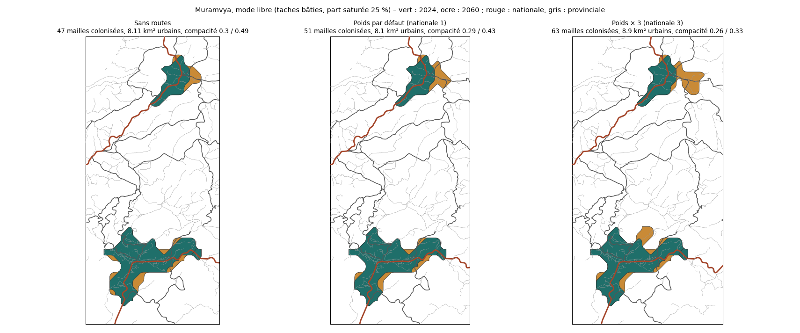

# Essai réel : attraction des routes à Muramvya (06/10/2026)

## Données

- **Routes** : téléchargées depuis OpenStreetMap par l'outil (`download-roads`), zone de la commune avec une marge de 2 km. 1 518 voies en 85 s : nationales 60,2 km, provinciales 364,0 km, autres 737,7 km. Le serveur principal (`overpass-api.de`) a refusé ou coupé la connexion depuis l'environnement de développement ; c'est le serveur de secours (`overpass.kumi.systems`) qui a répondu, et l'outil a basculé seul de l'un à l'autre.
- **Scénario** : `scenario_muramvya.json`, polygones de départ = taches bâties (1 500 hab/km², 5 000 habitants), mode libre, part saturée 25 % (comme l'essai du mode libre du 06/10), 2024 à 2060.

## Résultats (2060)

| Variante | Mailles colonisées | Surface urbaine | Compacité (les deux polygones urbains) | Extensions près d'une route principale | Même part, mailles rurales au départ |
|---|---|---|---|---|---|
| Sans routes | 47 | 8,11 km² | 0,30 / 0,49 | – | – |
| Poids par défaut (nationale 1, provinciale 0,6, autre 0,3) | 51 | 8,10 km² | 0,29 / 0,43 | 84 % | 69 % |
| Poids × 3 (3 / 1,8 / 0,9) | 63 | 8,90 km² | 0,26 / 0,33 | 100 % | 93 % |
| Poids par défaut, migration seule | 46 | 7,95 km² | 0,29 / 0,49 | 83 % | 69 % |

Chaque calcul dure environ 10 s, sans aucun habitant non accueilli, avec un bilan de masse nul.

## Lecture

- **Les routes déforment les extensions sans changer la croissance totale** : la compacité baisse (0,49 → 0,43 → 0,33 pour le village du nord) et les extensions partent le long des axes (au nord-est du village avec un poids × 3).
- **Avec les poids par défaut, l'effet est réel mais modeste**, comme dans le cas test : 84 % des extensions sont près d'une route principale, contre 69 % des mailles rurales.
- **La colonisation facilitée près des routes compte ici** : sans elle (migration seule), la compacité du village ne change pas (0,49).
- **Limite de l'indicateur** : une route est « principale » si son poids atteint 0,5. Avec des poids × 3, les routes « autres » le deviennent (0,9), et presque toute la commune est alors « près d'une route principale » (93 %). Pour comparer des variantes de poids, mieux vaut lire la compacité et la carte.
- Il s'agit d'**indicateurs de plausibilité** : sans historique d'urbanisation de Muramvya, rien ne permet de dire quel poids est « juste ». Une image satellite ancienne (par exemple 2010) et une récente permettraient de vérifier si les extensions réelles suivent la RN7 et les provinciales.

## À décider

Garder les poids par défaut validés (nationale 1), ou passer à un effet plus fort (par exemple nationale 2 à 3), en attendant un calage sur des extensions observées ?
