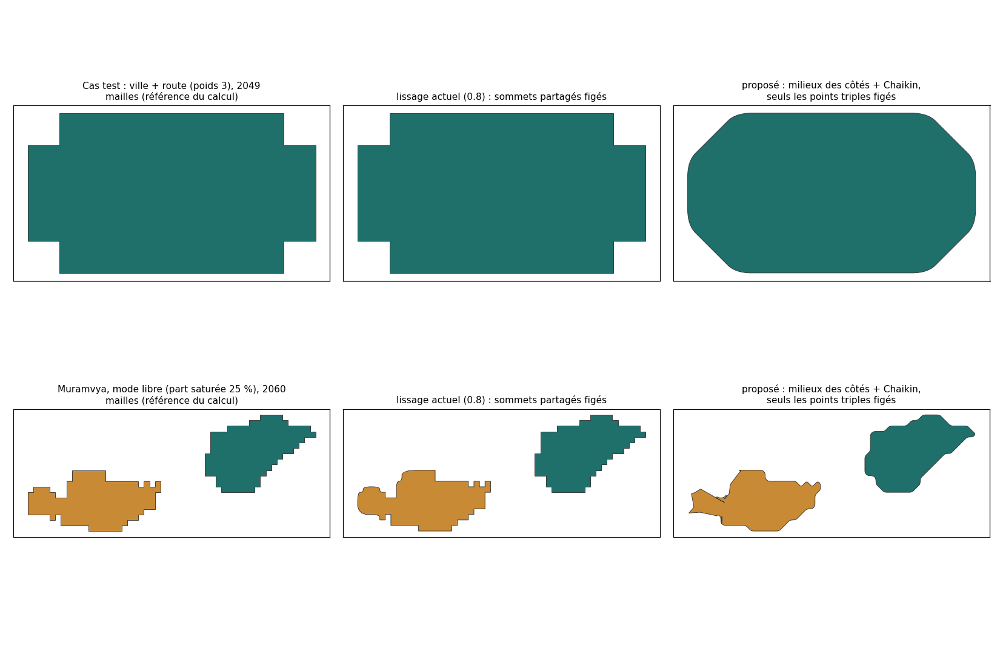
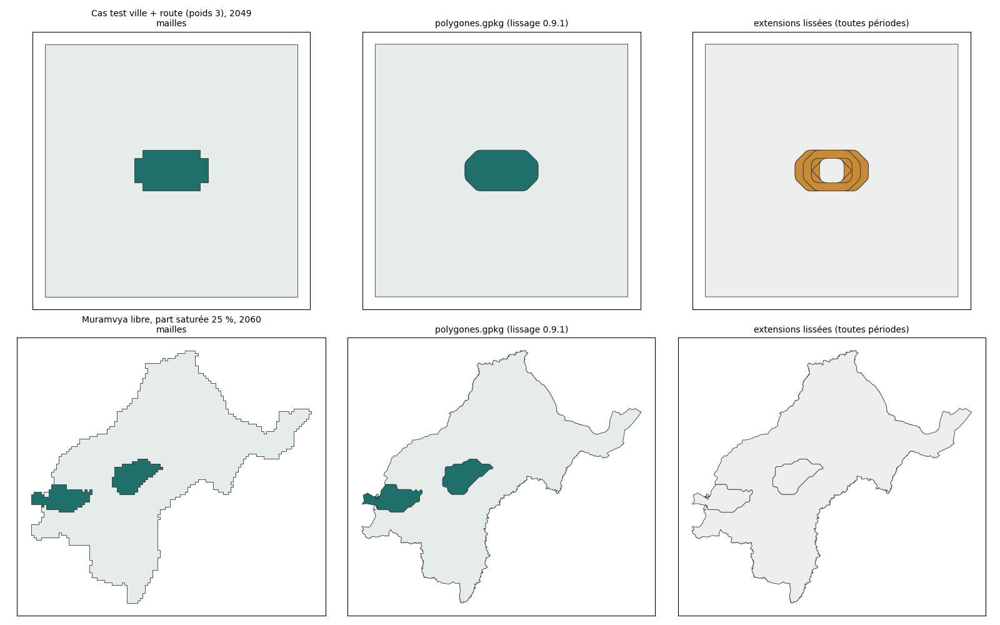

# Plan : lisser les polygones de sortie (mode libre)

| | |
|---|---|
| **Statut** | Validé le 06/10/2026 (L-a, L-b, L-c) et livré en 0.9.1 |
| **Demande du 06/10** | « Le but n'est pas d'avoir des polygones carrés suivant les mailles » |
| **Portée** | Affichage seulement (`polygones.gpkg`) : la grille reste la référence du calcul, les chiffres ne changent pas |

## Constat

Le lissage actuel (0.8) fige tout sommet partagé avec un autre polygone, pour que deux polygones voisins gardent une frontière commune. Or, en mode libre, la ville est entourée par le polygone rural : presque tous ses sommets sont partagés, donc figés, et le lissage ne fait presque rien. Les polygones restent « en escalier » (image, colonne du milieu).

## Proposition

1. **Ne figer que les points triples** : les sommets où se touchent au moins trois polygones, ou un polygone, un autre et l'extérieur. Une frontière entre deux polygones est lissée de la même façon des deux côtés (l'opération est symétrique), donc les polygones voisins restent jointifs, sans trou ni recouvrement.
2. **Supprimer l'escalier avant d'arrondir** : on place un sommet à chaque coin de maille, puis on joint les milieux des côtés (une diagonale en escalier devient une droite), puis on applique 3 passes de Chaikin (arrondi des angles).
3. **Limite de la zone d'étude** : les bords contre l'extérieur restent en escalier, puis le polygone est découpé par la vraie limite de la zone d'étude. Le contour suit donc la limite communale réelle.
4. **Extensions** : les extensions de chaque période sont la différence entre les polygones lissés de deux années, au lieu des mailles brutes.
5. Le réglage « Lissage (passes) » reste dans l'onglet Strates (0 = mailles brutes).

**Effet sur les surfaces affichées** : − 1,6 % pour le cas test, − 0,4 % et − 7 % pour les deux polygones urbains de Muramvya, dont le second touche la limite communale. Les surfaces des tableaux et de la plausibilité restent celles des mailles. Seul l'indice de compacité, calculé sur le contour lissé, changera.

## Points à trancher

| # | Question | Proposition |
|---|---|---|
| L-a | Méthode | Milieux des côtés + Chaikin, points triples figés (ci-dessus). Autre possibilité : un flou de la carte des polygones sur une grille 5 fois plus fine, avant de redessiner les contours. Le résultat serait plus « organique » mais plus lourd, et les doigts d'une maille de large le long des routes pourraient s'amincir |
| L-b | Nombre de passes par défaut | 3 (contre 2 aujourd'hui) |
| L-c | Doit-on lisser aussi le raster `polygon_id_AAAA.tif` ? | Non : il reste la vue exacte du calcul, maille par maille |

**Durée** : une demi-journée, tests compris.

## Résultat (0.9.1)

Muramvya (libre, part saturée 25 %, 2060) : 10,27 km² de mailles pour 10,27 km² dessinés pour le premier polygone urbain, 9,94 km² pour 9,76 km² dessinés pour le second, qui touche la limite communale. Le défaut du prototype à l'ouest (pointe le long de la limite) a disparu.

